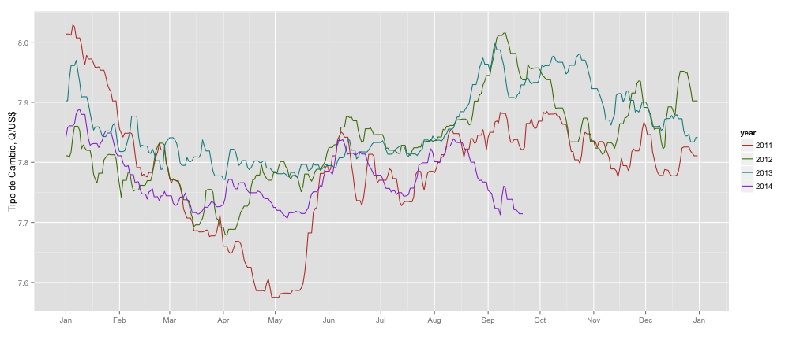

## The Exchange Rate Shiny App

In Guatemala, many companies need to keep track of the exchange rate for several reasons:

1. When supplies are bought from other countries, prices are generally quoted in US$
2. Some companies export their products and price their items in US$
3. Financial reports to parent companies outside Guatemala are mostly stated in US$

For these companies, it is important to understant the long term and short term trends of the exchange rate. It is also important to have some kind of forecast in order to plan ahead and make important decisions (such as when to buy a specific supply how to stock for a high-seasonality period)

The *exchange rate shiny app* aims to help you make informed decesion and keep track of this important indicator in a simple and reliable way. In order to be reliable, each time you visit the [exchange rate shiny app page](https://talent.shinyapps.io/Project/) data is loaded from [Guatemalan central bank's page](http://banguat.gob.gt/default.asp?lang=2) via web service.

--- .class #id 
## Daily Exchange Rate Chart

This chart will help you visualize the trend and seasonality of the exchange rate. When you first visit this tab, information is displayed for years 2011 - 2014. You can select which years you want displayed using the checkboxes provided to the left ot the chart.

 

--- .class #id 
## Monthly Exchange Rate Chart

This chart shows a monthly summarization of the exchange rate, and helps you visualize its long term trend over the last 15 years (from Jan 2000 up until the last available date in the bank's website). It also shows a forecast of the exchange rate for the next months. You can select the method of summarization and the forecasting horizon.

 

--- .class #id 
## Remarks

* Exchange rates are allways up to date as they are read from [Banguat](http://banguat.gob.gt/default.asp?lang=2).

* Banguat's website returns data in a format not suitable for plotting and analizing (XML). Please allow some time for the plots to be generated when you first visit the [App](https://talent.shinyapps.io/Project/).

* Keep in mind that the forecast is only a guide, as its only input is the observed exchange rate values. (i.e, it does not depend on other macroeconomic variables)

* Note that the confidence interval for the forecast is generally bigger for points further in time. This is the reason why you might want fewer months in the forecast.

